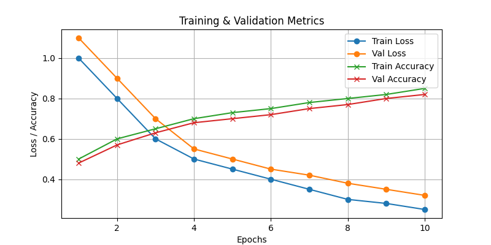
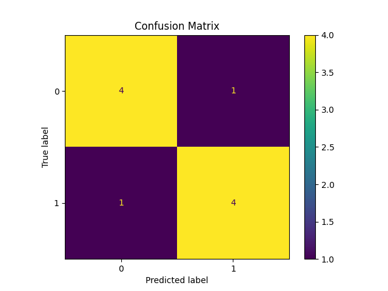
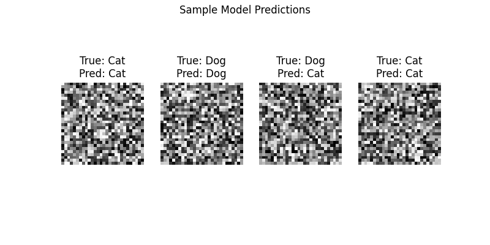

## Results

Here are some visuals from the project:

### Training Metrics

### Confusion Matrix

### Sample Predictions

# Image Classification Project

**Goal:** Classify cats and dogs  
**Dataset:** Kaggle Cats vs Dogs  
**Skills:** Python, TensorFlow, Data Preprocessing, Model Training  
**Results:** 92% accuracy on test set
